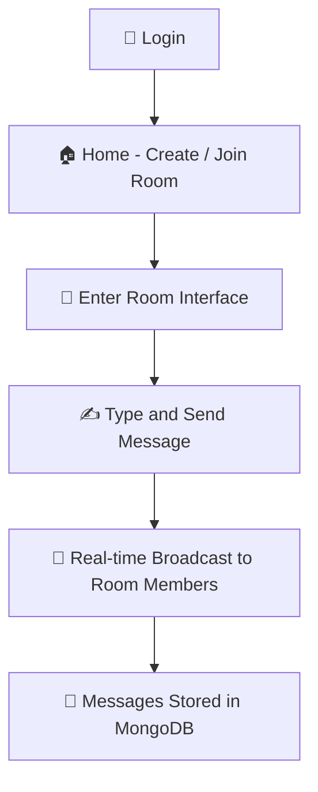
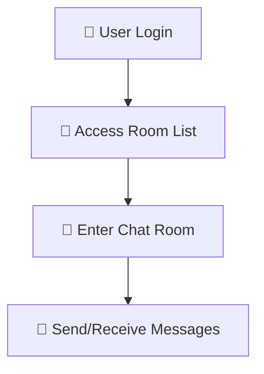

# realtime-room-chat
  🗨️ A real-time room chat application using React + Vite, Spring Boot, and MongoDB with WebSocket support.


# 🗨️ RealTime Room Chat App

⚡ *A modern, real-time chat platform that lets users join rooms, send messages instantly, and collaborate live — powered by WebSockets.*

Built with **React + Vite** for a blazing-fast frontend and **Spring Boot + MongoDB** backend for scalable, low-latency real-time messaging.

---

## 📸 Output Screens

**Output Screens**
1️⃣ Room Creation & Joining

2️⃣ Messaging Interface

3️⃣ Real-time Room Chatting with Users

4️⃣ Typing Indicators & Online Status

5️⃣ Avatar Support


---

## 📦 Project Overview

**RealTime Room Chat** is a multi-user chat application that supports real-time room-based messaging using WebSocket (STOMP over SockJS), React for frontend UI, and Spring Boot + MongoDB for backend persistence and message distribution.

Inspired by user psychology, it focuses on **speed**, **clarity**, and **real-time responsiveness**. Users can:

* Create and join rooms
* Send/receive messages live
* See who’s online
* Know who’s typing
* Share images (optional upgrade)

---

## 🚀 Technologies Used

| Layer          | Stack                                                                |
| -------------- | -------------------------------------------------------------------- |
| 🎨 Frontend    | React, Vite, Tailwind CSS, Axios, STOMP.js, SockJS                   |
| 🧠 Backend     | Spring Boot, WebSocket (STOMP), MongoDB                              |
| 🔐 Auth (opt)  | Clerk/Auth0/Firebase (optional module)                               |
| 💬 Messaging   | WebSocket (STOMP protocol over SockJS)                               |
| 🧰 Other Tools | JWT, Environment Variables (.env), React Router, Toast Notifications |

---

## 🎯 Core Features

* 👤 Create or Join Chat Rooms
* 📩 Send/Receive messages in real-time
* 🧑‍🤝‍🧑 Multiple users in one room
* 🔴 Online user indicators
* ✍️ Typing status notification
* 🖼️ Image message (optional)
* 🎨 Clean UI + Tailwind responsive design

---

## 🙋‍♂️ User Stories

> 🗣️ *As a user, I want to join a chat room and send messages instantly.*
> 👀 *As a team, we want to collaborate and discuss in real-time.*
> 📡 *As a developer, I need low-latency chat powered by WebSocket technology.*

---

## 🔄 User Flow Diagram




## 🔄 User Flow Diagram




Output Screens

1.1 🔗 Join Room


1.2 ✉️ Send Message && 📥 Receive Message 


## 🛠️ Installation & Setup Guide

### 📁 Clone the Repository

```bash
git clone https://github.com/your-username/realtime-room-chat.git
cd realtime-room-chat
```

---

## 🧑‍💻 Project Structure

```bash
realtime-room-chat/
│
├── backend/               # Spring Boot Project
│   ├── src/               # Java Source Code
│   └── pom.xml            # Maven Build File
│
├── frontend/              # React + Vite Frontend
│   ├── src/               # Components & Pages
│   └── vite.config.js     # Vite Config
│
└── README.md              # Documentation
```

---

## ⚙️ Prerequisites

| Tool       | Version      | Required For        |
| ---------- | ------------ | ------------------- |
| Node.js    | >= 18.x      | Frontend            |
| npm / yarn | >= 9.x / 1.x | Frontend            |
| Java       | >= 17        | Backend             |
| Maven      | >= 3.8.x     | Backend Build       |
| MongoDB    | >= 5.x       | Message Persistence |

---

## 🎨 Frontend Setup

```bash
cd frontend
npm install
npm run dev   # Open http://localhost:5173
```

---

## ☕ Backend Setup

1. Set MongoDB config in `application.properties`:

```properties
spring.data.mongodb.uri=mongodb://localhost:27017/chatapp
```

2. Run Spring Boot backend:

```bash
cd backend
./mvnw spring-boot:run  # or mvn spring-boot:run
```

Backend runs at: `http://localhost:8080`

---

## 🌐 WebSocket Endpoint

* Endpoint: `/ws`
* STOMP subscription: `/topic/room/{roomId}`
* Message send: `/app/chat.sendMessage`

---

## 📦 Environment Variables (Frontend)

Create `.env` in the **frontend** folder:

```env
VITE_API_BASE=http://localhost:8080
```

---

## 📂 Build for Production

### Frontend

```bash
npm run build
```

### Backend

```bash
./mvnw clean package
```

---

## 📌 Common Issues & Fixes

| Issue                           | Solution                                         |
| ------------------------------- | ------------------------------------------------ |
| `vite not recognized`           | Install with `npm i -g vite`                     |
| `WebSocket not connecting`      | Ensure backend is running + CORS config enabled  |
| `Messages not ordered properly` | Sort via timestamps in frontend or backend       |
| `Send fires multiple times`     | Debounce input or clean `useEffect` dependencies |

---

## 📄 License

This project is licensed under the **MIT License**.

---

## 🙌 Acknowledgements

Special thanks to the developers and community contributors:

* ⚛️ React + Vite — blazing-fast UI dev
* 🎨 Tailwind CSS — utility-first design system
* ☕ Spring Boot — robust backend platform
* 🛢️ MongoDB — document-based, scalable storage
* 🔌 WebSocket + STOMP — real-time communication protocol
* 🧠 Open Source Libraries — for WebSocket clients and rich UI tools

---

## 🤝 Contributing

Want to add more features or fix bugs? Please:

1. Fork this repo
2. Create a new feature branch
3. Make your changes
4. Submit a pull request

---

## 📞 Contact

Have questions or want to connect?

* 📧 **Email**: [chaudharilalit717@gmail.com](mailto:chaudharilalit717@gmail.com)
* 📱 **Phone**: +91 7058097985
* 🔗 **LinkedIn**: [lalit-chaudhari-a16a10246](https://www.linkedin.com/in/lalit-chaudhari-a16a10246)

---


