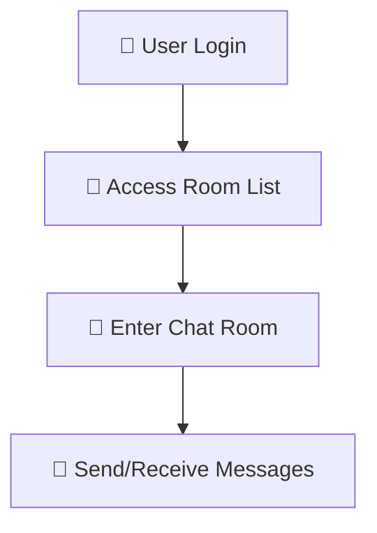

# realtime-room-chat
  🗨️ A real-time room chat application using React + Vite, Spring Boot, and MongoDB with WebSocket support.

 #Output Screen
 

  📦 Project Overview

Realtime Chat App is a full-stack chat application designed to enable seamless real-time communication between users. The application is built using Vite + React on the frontend, Spring Boot on the backend, and MongoDB as the primary NoSQL database. It uses Tailwind CSS for responsive UI styling and WebSockets for real-time messaging.

The application provides features such as real-time messaging, user authentication, online status indicators, and persistent message storage. The backend APIs are built in Java using Spring Boot, with MongoDB providing scalable and fast data operations.

Realtime Chat App is a portfolio project demonstrating modern full-stack web development using a reactive UI and robust backend architecture.

⸻

🚀 Technologies Used

	•	Frontend: React, Vite, Tailwind CSS
	•	Backend: Java, Spring Boot
	•	Database: MongoDB
	•	Real-time Communication: WebSockets
	•	Other Tools: JWT, REST APIs, Axios

## ✈️ Scope Plane

### 🧠 Feature Planning

* 🏠 Public and private chat rooms
* 🕓 Message timestamps
* ✅ Message delivery status indicators

## 🧾 Content Requirement Planning

### 📝 Text

* Chat messages
* User notifications
* System prompts

### 🖼️ Images

* User avatars
* Image messages shared in chat

### 📹 Videos

* ❌ Not supported currently

## 🌐 Integrating Content Strategy & SEO

* 🔍 Not applicable for real-time app
* 🏷️ Basic metadata included for better web representation

## 🙋‍♂️ User Stories

> "As a user, I want to send and receive messages instantly so I can communicate in real-time."

## 🏗️ Structure Plane

### 🕹️ Interaction Design

* Single Page Application (SPA) with a dynamic, real-time chat interface

## 🔄 User Flow Diagram

Output Screens

1.1 🔗 Join Room

1.2 ✉️ Send Message && 📥 Receive Message 

## 🙏 Acknowledgements

We would like to express our gratitude to the following technologies and resources that made this real-time chat application possible:

* ⚛️ **React** – For building a fast, interactive, single-page user interface.
* 🎨 **Tailwind CSS** – For providing a clean and responsive design with utility-first styling.
* ☕ **Spring Boot** – For simplifying the backend architecture and enabling robust REST APIs.
* 🧩 **MongoDB** – For flexible, document-based data storage for rooms and messages.
* 🔌 **STOMP over SockJS** – For enabling reliable, bidirectional real-time messaging between client and server.
* 🧠 **Open Source Community** – For invaluable documentation, discussions, and support across GitHub, Stack Overflow, and official docs.

